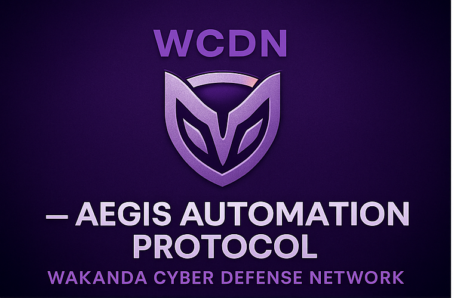
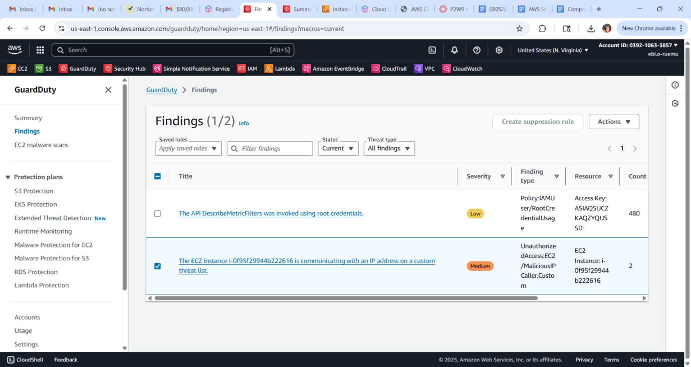
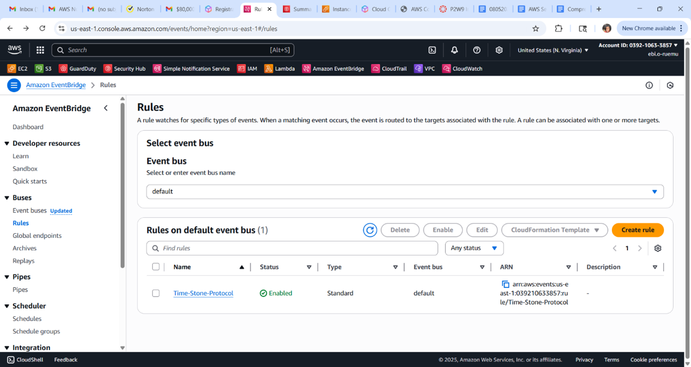
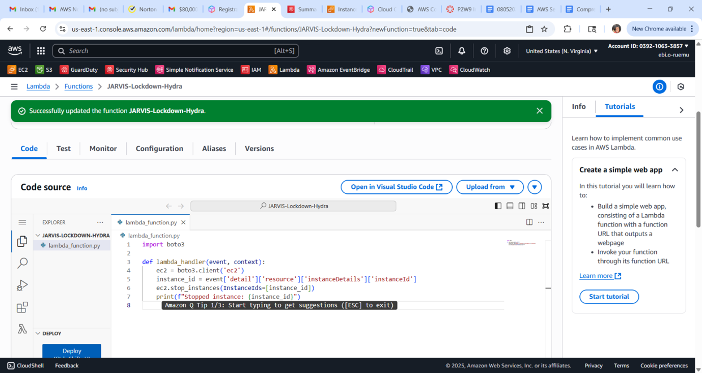
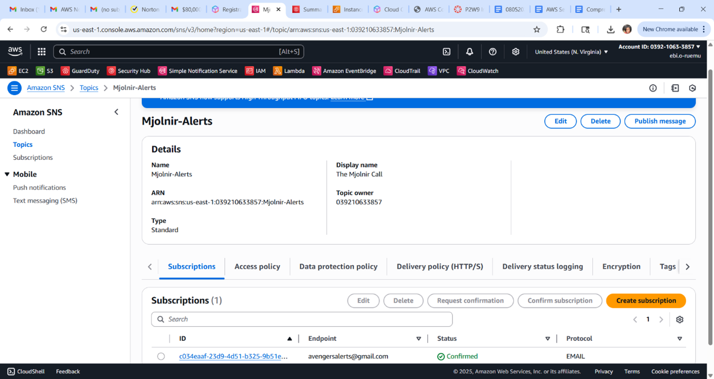
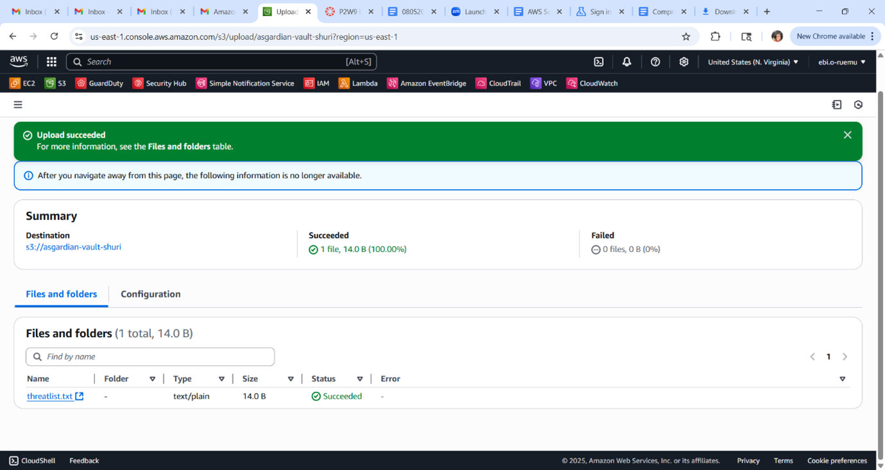

# 🛡️ WCDN – Aegis Automation Protocol
### Automated Cloud Incident Response • GuardDuty • EventBridge • Lambda

---

## 🔍 Project Overview
The **Aegis Automation Protocol** simulates a full AWS cloud incident response workflow, including threat detection with GuardDuty, automated alerting via EventBridge and SNS, and Lambda-powered remediation.  
This project demonstrates real-world cloud defense engineering and SOAR-style automation in an enterprise-ready AWS environment.

---

## 🧠 Skills Demonstrated
- Cloud Incident Response  
- GuardDuty Triage & Investigation  
- EventBridge Rule Engineering  
- Lambda Automation (Python)  
- SNS Alerting Pipelines  
- Threat List Management  
- CloudTrail Forensics  

---

## 🛠️ Tools & Technologies
**AWS GuardDuty, Security Hub, EventBridge, Lambda, SNS, CloudTrail, EC2, VPC**

---

# 📸 Screenshots
Evidence collected during the automation workflow:

- **GuardDuty Finding**
  

- **EventBridge Rule**
  

- **Lambda Remediation Function**
  

- **SNS Alert Notification**
  

- **Threat List / Indicators**
  

---

# 📘 Documentation
- `documentation/methodology.md`  
- `documentation/findings.md`  
- `reports/executive-summary.pdf`

---

# 🧩 Lessons Learned
- Automation closes detection → response gaps  
- Threat list maintenance is essential  
- EventBridge is powerful for correlation  
- CloudTrail is critical for root cause validation  

---

# ⚖️ Ethical Notice
All cloud resources were created for educational purposes inside isolated AWS accounts. No production systems were impacted.

---

# 🏁 Summary
This project showcases a complete automated cloud defense workflow using AWS-native tools, simulating enterprise-grade incident response.

